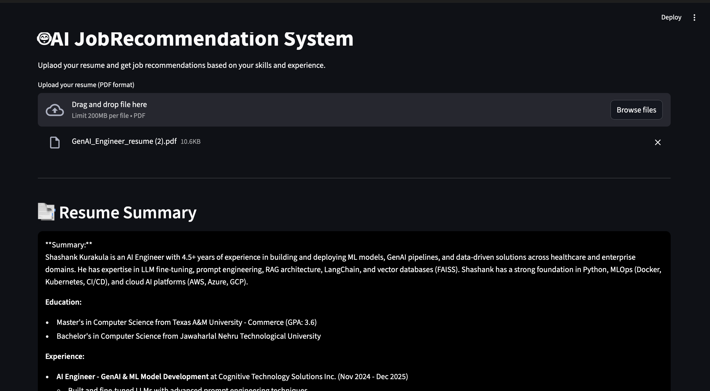
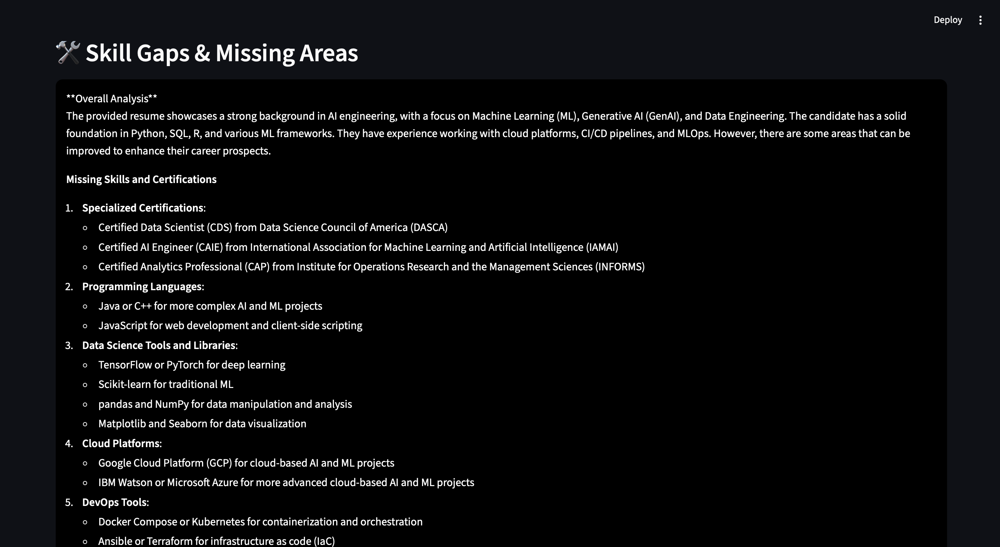
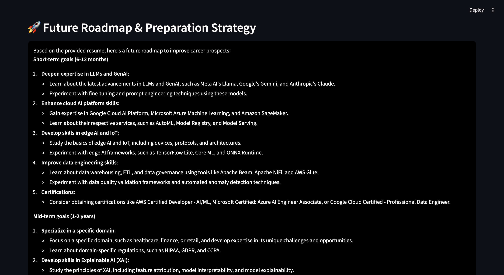
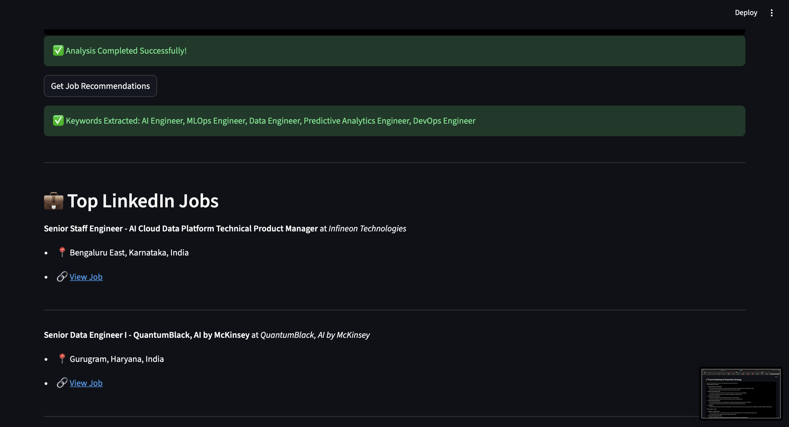
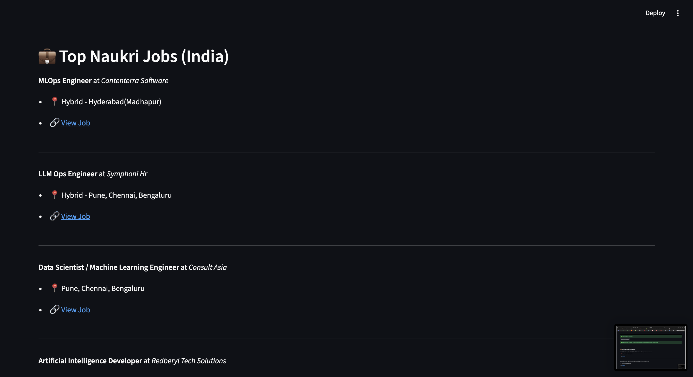

# AI Job Recommendation System

An AI-powered resume analysis and job recommendation project built with `Streamlit`, `Groq`, `PyMuPDF`, `Apify`, and an `MCP server`.

The project extracts text from a resume, analyzes the candidate profile, identifies skill gaps, suggests a career roadmap, recommends relevant jobs from LinkedIn and Naukri, and exposes job-fetching tools through an MCP server for tool-based integrations.

Live Demo: [Job Recommendation System](https://jobrecommendationsystemgenai-shahsank.streamlit.app)


## Overview

This project is designed to make resume analysis more practical and actionable.

Instead of only summarizing a resume, the app also:

- extracts the candidate's profile from a PDF resume
- generates a concise AI summary
- identifies missing skills and improvement areas
- suggests a future learning and career roadmap
- recommends relevant job roles based on the resume content
- fetches matching jobs from LinkedIn and Naukri
- exposes job search tools through an MCP server

## Features

- Resume upload in PDF format
- AI-generated resume summary
- Skill gap analysis
- Career roadmap suggestions
- Relevant job title extraction from resume data
- Job recommendations from external job platforms
- MCP server support for tool-based job retrieval
- Streamlit-based interactive UI

## How It Works

1. Upload a resume in PDF format.
2. The app extracts text using `PyMuPDF`.
3. A Groq LLM analyzes the resume and generates:
   - a summary
   - skill gap insights
   - a future roadmap
4. The app extracts the most relevant job titles from the resume summary.
5. Those keywords are used to fetch jobs from:
   - LinkedIn
   - Naukri
6. Matching jobs are displayed with location and job links when available.
7. The same job-fetching logic is exposed through MCP tools for integration with MCP-compatible clients.

## MCP Server

This project also includes an MCP server in [`mcp_server.py`](/Users/shashank/Projects/Job_recommendation_system/mcp_server.py).

It exposes two tools:

- `fetch_linked` for LinkedIn job search
- `fetch_naukri` for Naukri job search

This makes the project usable in two ways:

- as a Streamlit application for end users
- as an MCP-compatible backend for AI agents and tool-calling workflows

## Tech Stack

- `Python`
- `Streamlit`
- `Groq LLM`
- `PyMuPDF`
- `Apify`
- `MCP (Model Context Protocol)`
- `python-dotenv`

## Project Structure

```text
Job_recommendation_system/
├── app.py
├── mcp_server.py
├── requirements.txt
├── .env
└── src/
    ├── helper.py
    └── job_api.py
```

## Installation

1. Clone the repository:

```bash
git clone <your-repo-url>
cd Job_recommendation_system
```

2. Install dependencies:

```bash
pip install -r requirements.txt
```

3. Create a `.env` file and add your API keys:

```env
GROQ_API_KEY=your_groq_api_key
APIFY_API_TOKEN=your_apify_token
```

4. Run the app:

```bash
streamlit run app.py
```

5. Run the MCP server:

```bash
python mcp_server.py
```

## Environment Variables

The project requires:

- `GROQ_API_KEY`
- `APIFY_API_TOKEN`

## Use Cases

- Students looking for role recommendations based on their resume
- Job seekers who want personalized improvement suggestions
- Professionals exploring career transitions
- Recruiters or mentors who want quick AI-assisted resume insights

## Why This Project Matters

Most resume tools stop at basic analysis. This project goes further by combining:

- resume understanding
- career guidance
- skill gap identification
- live job discovery
- MCP-based tool integration

That makes it a practical GenAI project with clear real-world value.

## Demo

Try the live app here:

[https://jobrecommendationsystemgenai-shahsank.streamlit.app](https://jobrecommendationsystemgenai-shahsank.streamlit.app)

## Future Improvements

- support for more job platforms
- better filtering by location and experience
- resume scoring
- downloadable analysis report
- improved prompt engineering and structured outputs
- authentication and saved user history

## Author

Shashank

If you are showcasing this on LinkedIn, this project demonstrates:

- applied GenAI integration
- LLM-powered workflow design
- document parsing
- API integration
- MCP server implementation
- product thinking with an end-to-end user flow

## Screenshots

### Home Screen



### Resume Analysis



### Skill Gap Insights



### Career Roadmap



### Job Recommendations

